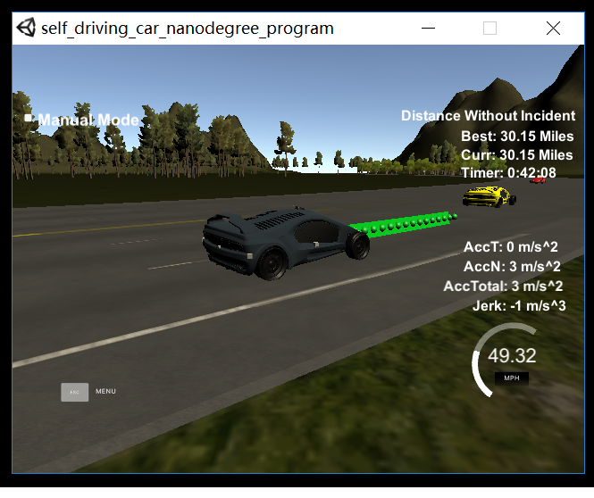

# CarND-Path-Planning-Project
Self-Driving Car Engineer Nanodegree Program
   
## Goals
In this project the goal is to safely navigate around a virtual highway with other traffic that is driving +-10 MPH of the 50 MPH speed limit. You will be provided the car's localization and sensor fusion data, there is also a sparse map list of waypoints around the highway. The car should try to go as close as possible to the 50 MPH speed limit, which means passing slower traffic when possible, note that other cars will try to change lanes too. The car should avoid hitting other cars at all cost as well as driving inside of the marked road lanes at all times, unless going from one lane to another. The car should be able to make one complete loop around the 6946m highway. Since the car is trying to go 50 MPH, it should take a little over 5 minutes to complete 1 loop. Also the car should not experience total acceleration over 10 m/s^2 and jerk that is greater than 50 m/s^3.

## Implementation
	The whole path planner is implemented in the main.cpp .And a spline.h is included by main.cpp for the path points smoothy interpolation.
	
### 1.  Hyper parameters preset:
		In the lines 328-335 of main.cpp,some hyper parameters are set as follows:
		//starting from middle lane (0,1,2 are defined as the normal three lane numbers in our project situation of three lanes in each side )
		int lane=1; 
		// sensing data feedback every 0.02s in our simulator , if sensing_period is too long , there will be  problems to make the car safe and smooth
		double sensing_period = 0.02; 
		// starting reference speed in miles per hour. It is also the velocity change in every sensing_period, about 4.91744 m/s^2 , the 0.224 will seldomly cause acceleration over 10 m/s^2 if the car runs several rounds of road. 
		double ref_vel=0.22; 
		// to prevent lane changing too frequently,lane_change_interval limit should be between 1 second to 10 second ,here to make the car change lane showing more frequently, select the boundary limit of 1 second
		double lane_change_interval= 1.0;
		// to record the time passed since last lane chaning
		double time_passed_lane_changed=0.0;

### 2. Front car distance & car velocity adjust
 		In the lines 380-423 of main.cpp,the car calculate the front car distance ,if the distance is too close, the car velocity should be slowed down with a 0.22 mph step.
		Here i set the safe distance to 30 meters and the upper velocity boundary to 49.5 miles per hour.
		
### 3. Add the first two new path points derived from end tangent of last state
		In the lines 429-473 of main.cpp,i add the first two new path points derived from end tangent of last state.
		In this path planner,i set the number of waypoints of every planning to 25 points ,which about 25*0.02=0.5 second.This will help to react quickly in crowd cars and rapid changing envronment situation.So i can always finish the previous planned waypoints .And i should caculate the end tangent of last state for a smooth movement planning.
		
### 4. Lane select according to cost calculation
		In the lines 476-478 of main.cpp, i make lane selection according to cost calculation.
		int end_path_lane = d2Lane(end_path_d);
      	int action = getLowestCostAction(end_path_s, end_path_lane, car_speed,sensor_fusion,sensing_period);
		
		In the lines 107-128 of main.cpp, i define the getLowestCostAction function.
		
		In the lines 57-106 of main.cpp, i define the getCostOfStraightCourse function and getCostOfLaneChange function. and consider more for the lane change ,which is shown as follows:
		
		int new_lane = car_l + direction;
		if (new_lane < 0 | new_lane > 2) {
				return 10000.0;
		}
		// take into consideration not only the distance of front car and behind car of current lane ,but also front the velocity of front car and behind car of current lane, besides ,take into consideration not only the distance of front car and behind car of caculated changing lane ,but also front the velocity of front car and behind car of  caculated changing lane,
		double present_lane_front_dist = closestCarParams(car_s, car_l , true, sensor_fusion)[0];
		double present_lane_behind_dist = closestCarParams(car_s, car_l , false, sensor_fusion)[0];
		double present_lane_front_vel = closestCarParams(car_s, car_l , true, sensor_fusion)[1];
		double present_lane_behind_vel = closestCarParams(car_s, car_l , false, sensor_fusion)[1];

		double new_lane_front_dist = closestCarParams(car_s, new_lane, true, sensor_fusion)[0];
		double new_lane_behind_dist = closestCarParams(car_s, new_lane, false, sensor_fusion)[0];
		double new_lane_front_vel = closestCarParams(car_s, new_lane, true, sensor_fusion)[1];
		double new_lane_behind_vel = closestCarParams(car_s, new_lane, false, sensor_fusion)[1];
		
		// for lane change,generally the car is changing from middle of current lane to the middle of next lane, so the car first increase lateral speed until to the border of next lane,then decrease speed to the middle of next lane, to drive below the acceleration limit, for example ,at a=4.91744 m/s^2, it should take time of t=sqrt(2.0*2/a)=0.902 s to get to the border of next lane,which means about 46 time slots of 0.02, but in the real simulation, i found 33 time slot can generally meet the acceleration limit.
		
		double lane_change_half_time= 33*0.02;  
		double behind_smoothy_speed_down_time= ceil(fabs(new_lane_behind_vel - car_speed)/0.22)*sensing_period ;
		double new_lane_behind_safe_distance=  2.5* behind_smoothy_speed_down_time * behind_smoothy_speed_down_time +5.0; //5.0m buffeer

		double front_smoothy_speed_down_time= ceil(fabs(car_speed - new_lane_front_vel )/0.22)*sensing_period ;
		double new_lane_front_safe_distance=  2.5* front_smoothy_speed_down_time * front_smoothy_speed_down_time +5.0;   //5.0m buffer
    
		if (new_lane_front_dist > 30.0 && new_lane_behind_dist > 10.0  ) 
		{   // front safe distance set to 30m,behind safe distance maybe set between (10m,30m),here 10m is bounday test for simulator, in reality ,it is better set to 30.0m
		
			if(car_speed >= new_lane_behind_vel || ((car_speed < new_lane_behind_vel) &&(new_lane_behind_dist -lane_change_half_time*(new_lane_behind_vel - car_speed) ) >  new_lane_behind_safe_distance ) )
		{
		if(car_speed <= new_lane_front_vel || ((car_speed > new_lane_front_vel) &&((new_lane_front_dist -2.0*lane_change_half_time*(car_speed - new_lane_front_vel ) ) > new_lane_front_safe_distance)))
		{
		//&&(( 3.0*lane_change_half_time*(car_speed - new_lane_front_dist )- present_lane_front_dist  )> 5.0) )    // more constrained conditons, safer but less chance to change lane
	
		return 1.0 / new_lane_front_dist + 0.5 / new_lane_behind_dist;
		}
		}
		}

		return 10000.0;

### 5.  Select anchor points and make interpolation
		In the lines 483-603 of main.cpp, i select anchor points and make interpolation for the path planning waypoints.
		For the situation of keep current lane ,i select 3 anchor points every next 30 meters in s coordinate.
		For the situation of lane changing ,i select only next 2 anchor points except for the current car position. one is border line to the next lane ,the other is the middle of next lane. And here for test border situation ,i take also 33 time slots to get to the border line .maybe 46 time slots will be better.
		
##  Result
	I test 4 times in my computer,every time the car drive smoothy all the way in severals continous rounds. I just take a snapshot of about 6 rounds of successful continous driving about 30 miles.
  
	

## Reflections:
	This project is something touch for calculating and tuning ,it takes me lots of time .And it gives me lots of inspiration.Eventually, the car moves smoothy and continously.
	Because of time limit ,i think there are still something which can be do further.
	1)Now i only calculate cost of one level of front car and behind car, since we get the sensorfusion of all cars of sensing range,we can consider mutiple levels to get a best policy of lane select.
	2)we can incorperate the controller part into the path planner,which will make this design more robust.

	
-----------------------------------------------------------------------------------------------------------------------------------------------------------------------------------------
## Other Backgroud Information

#### The map of the highway is in data/highway_map.txt
Each waypoint in the list contains  [x,y,s,dx,dy] values. x and y are the waypoint's map coordinate position, the s value is the distance along the road to get to that waypoint in meters, the dx and dy values define the unit normal vector pointing outward of the highway loop.

The highway's waypoints loop around so the frenet s value, distance along the road, goes from 0 to 6945.554.

### Simulator.
You can download the Term3 Simulator which contains the Path Planning Project from the [releases tab (https://github.com/udacity/self-driving-car-sim/releases).

### Basic Build Instructions

1. Clone this repo.
2. Make a build directory: `mkdir build && cd build`
3. Compile: `cmake .. && make`
4. Run it: `./path_planning`.

Here is the data provided from the Simulator to the C++ Program

#### Main car's localization Data (No Noise)

["x"] The car's x position in map coordinates

["y"] The car's y position in map coordinates

["s"] The car's s position in frenet coordinates

["d"] The car's d position in frenet coordinates

["yaw"] The car's yaw angle in the map

["speed"] The car's speed in MPH

#### Previous path data given to the Planner

//Note: Return the previous list but with processed points removed, can be a nice tool to show how far along
the path has processed since last time. 

["previous_path_x"] The previous list of x points previously given to the simulator

["previous_path_y"] The previous list of y points previously given to the simulator

#### Previous path's end s and d values 

["end_path_s"] The previous list's last point's frenet s value

["end_path_d"] The previous list's last point's frenet d value

#### Sensor Fusion Data, a list of all other car's attributes on the same side of the road. (No Noise)

["sensor_fusion"] A 2d vector of cars and then that car's [car's unique ID, car's x position in map coordinates, car's y position in map coordinates, car's x velocity in m/s, car's y velocity in m/s, car's s position in frenet coordinates, car's d position in frenet coordinates. 

### Details

1. The car uses a perfect controller and will visit every (x,y) point it recieves in the list every .02 seconds. The units for the (x,y) points are in meters and the spacing of the points determines the speed of the car. The vector going from a point to the next point in the list dictates the angle of the car. Acceleration both in the tangential and normal directions is measured along with the jerk, the rate of change of total Acceleration. The (x,y) point paths that the planner recieves should not have a total acceleration that goes over 10 m/s^2, also the jerk should not go over 50 m/s^3. (NOTE: As this is BETA, these requirements might change. Also currently jerk is over a .02 second interval, it would probably be better to average total acceleration over 1 second and measure jerk from that.

2. There will be some latency between the simulator running and the path planner returning a path, with optimized code usually its not very long maybe just 1-3 time steps. During this delay the simulator will continue using points that it was last given, because of this its a good idea to store the last points you have used so you can have a smooth transition. previous_path_x, and previous_path_y can be helpful for this transition since they show the last points given to the simulator controller with the processed points already removed. You would either return a path that extends this previous path or make sure to create a new path that has a smooth transition with this last path.

### Tips

A really helpful resource for doing this project and creating smooth trajectories was using http://kluge.in-chemnitz.de/opensource/spline/, the spline function is in a single hearder file is really easy to use.

---

### Dependencies

* cmake >= 3.5
 * All OSes: [click here for installation instructions](https://cmake.org/install/)
* make >= 4.1
  * Linux: make is installed by default on most Linux distros
  * Mac: [install Xcode command line tools to get make](https://developer.apple.com/xcode/features/)
  * Windows: [Click here for installation instructions](http://gnuwin32.sourceforge.net/packages/make.htm)
* gcc/g++ >= 5.4
  * Linux: gcc / g++ is installed by default on most Linux distros
  * Mac: same deal as make - [install Xcode command line tools]((https://developer.apple.com/xcode/features/)
  * Windows: recommend using [MinGW](http://www.mingw.org/)
* [uWebSockets](https://github.com/uWebSockets/uWebSockets)
  * Run either `install-mac.sh` or `install-ubuntu.sh`.
  * If you install from source, checkout to commit `e94b6e1`, i.e.
    ```
    git clone https://github.com/uWebSockets/uWebSockets 
    cd uWebSockets
    git checkout e94b6e1
    ```

### Editor Settings

We've purposefully kept editor configuration files out of this repo in order to
keep it as simple and environment agnostic as possible. However, we recommend
using the following settings:

* indent using spaces
* set tab width to 2 spaces (keeps the matrices in source code aligned)

### Code Style

Please (do your best to) stick to [Google's C++ style guide](https://google.github.io/styleguide/cppguide.html).

## Project Instructions and Rubric

Note: regardless of the changes you make, your project must be buildable using
cmake and make!


### Call for IDE Profiles Pull Requests

Help your fellow students!

We decided to create Makefiles with cmake to keep this project as platform
agnostic as possible. Similarly, we omitted IDE profiles in order to ensure
that students don't feel pressured to use one IDE or another.

However! I'd love to help people get up and running with their IDEs of choice.
If you've created a profile for an IDE that you think other students would
appreciate, we'd love to have you add the requisite profile files and
instructions to ide_profiles/. For example if you wanted to add a VS Code
profile, you'd add:

* /ide_profiles/vscode/.vscode
* /ide_profiles/vscode/README.md

The README should explain what the profile does, how to take advantage of it,
and how to install it.

Frankly, I've never been involved in a project with multiple IDE profiles
before. I believe the best way to handle this would be to keep them out of the
repo root to avoid clutter. My expectation is that most profiles will include
instructions to copy files to a new location to get picked up by the IDE, but
that's just a guess.

One last note here: regardless of the IDE used, every submitted project must
still be compilable with cmake and make./
